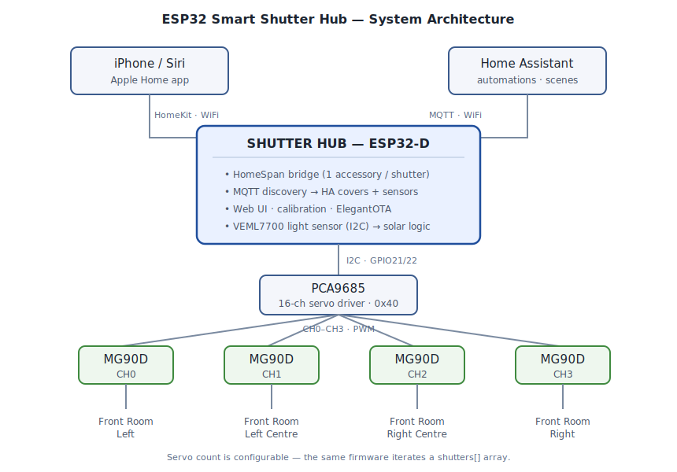
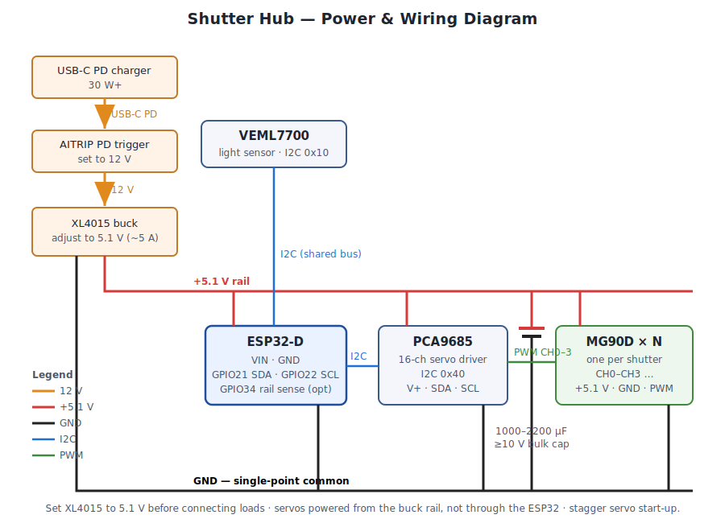
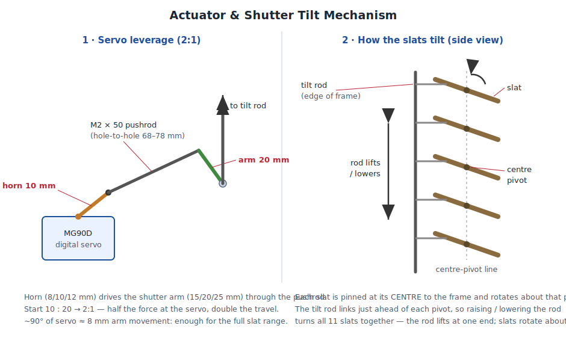

# ESP32 Smart Shutter Hub

A compact, DIY smart-home controller that tilts existing internal plantation shutters with servo
actuators — behaving like a commercial product while staying small, cheap, mains-free (wired 5 V),
and fully local. One wall-mounted **hub** drives a configurable number of shutters (initially four
in the Front Room) and integrates natively with Apple Home and Home Assistant. Replaces a bulky
Zemismart JM36/JC601.

## Features

- **Hub architecture** — one ESP32 drives all shutters via a PCA9685; simple MG90D actuator modules.
- **Variable shutter count** — 1 to 4, by configuration only (no firmware change).
- **Apple HomeKit** — HomeSpan bridge exposes each shutter as its own Window Covering accessory.
- **Home Assistant** — one `cover.*` per shutter via MQTT discovery, plus lux/position sensors.
- **Local web UI** — control, per-shutter calibration, and OTA at `http://shutter-hub.local`.
- **Wiring at a glance** — an Info-page table of every device, its I²C bus, pins, address and channel.
- **Per-shutter calibration** — closed/open limits + named favourites (Privacy, Daylight) in µs.
- **Solar heat protection** — VEML7700 sunlight monitoring with configurable trip/clear thresholds.
- **Manual-override handling** — automation backs off for 2 h after a manual move.

## How it works

One ESP32-D hub speaks to Apple Home (HomeSpan) and Home Assistant (MQTT) over WiFi, and drives the
servos through a PCA9685. A VEML7700 light sensor feeds the solar heat-protection logic. The number
of shutters is configuration, not code.

**Power & wiring**

**Actuator linkage**

## Hardware (locked)

| Component | Choice | Default pins (ESP32-D) |
| --------- | ------ | ---------------------- |
| Controller | ESP32-D | — |
| Servo driver | PCA9685 (16-ch I2C, `0x40`) | `Wire` — SDA **GPIO21**, SCL **GPIO22** |
| Servos | MG90D digital metal-gear ×4 | PCA9685 **CH0–CH3** |
| Power | USB-C PD → AITRIP trigger (12 V) → XL4015 @ 5.1 V | — |
| Light sensor | VEML7700 (I2C, `0x10`) | `Wire1` — SDA **GPIO25**, SCL **GPIO26** |
| Linkage | M2 × 50 mm ball-link pushrod + printed arms | — |

By default the sensor sits on a **second, separate I2C bus** so a fault on its lead can never wedge
the servo bus ([ADR 0011](docs/decisions/0011-dedicated-sensor-i2c-bus.md)). It can also be told to
**share** the PCA9685's bus ([ADR 0012](docs/decisions/0012-selectable-sensor-i2c-bus.md)) — the only
option on chips with a single I2C controller, such as the ESP32-C3. Every pin above is
runtime-configurable and stored in NVS. Full map, including the ESP32-C3 proposal and the pins the
firmware rejects: **[docs/pinout.md](docs/pinout.md)**.

## Installation

Full step-by-step in **[docs/installation.md](docs/installation.md)**; everyday operation in
**[docs/user-guide.md](docs/user-guide.md)**. The short version:

1. **Flash once over USB.** Take the `esp32d-pca9685` assets from a
   [release](https://github.com/rhamblen/esp32-shutter-hub/releases) and write the `-full-` image to
   `0x0` plus the `-littlefs-` image — or build from source with
   `pio run -e esp32d-pca9685 -t upload && pio run -e esp32d-pca9685 -t uploadfs`.
   Flash the filesystem too; without it the hub serves only a bare OTA recovery page.
2. **Join your WiFi.** The hub raises a `Shutter-Hub-Setup` access point with a captive portal. Pick
   your 2.4 GHz network once — the credentials live in NVS and survive every future update.
3. **Open `http://shutter-hub.local`** and confirm a servo sweeps from the **Servo test** page.
4. **Define and calibrate each shutter** on the **Shutters** page: name it, assign its PCA9685
   channel, then set its closed/open endpoints and Daylight/Privacy favourites with the slow-run →
   stop → nudge transport. Everything else depends on this step.
5. **Point it at your MQTT broker** (**MQTT → Broker**, discovery on) and the covers, preset buttons
   and solar entities appear in Home Assistant by themselves. Optionally add the Lovelace card from
   [ha-card/](ha-card/), pair the HomeKit bridge from **System → HomeKit**, and set the trip/clear
   thresholds on the **Solar** page.

After the first flash every update goes over WiFi from the **OTA Update** page — settings,
calibration, and pairings are untouched.

## Status

**Current release `v0.6.2`.** In daily use: the web UI, per-shutter calibration, Home Assistant
control over MQTT, and the Lovelace card. Two things are built but unproven — **HomeKit pairing does
not work** and the **light sensor is not yet wired**; both are detailed below.

Every shutter
defined in the web UI appears in HA as a native **`cover`** (open/close/stop + position 0–100) plus
six **`button`** entities (jog open/close, Daylight/Privacy recall + save) via MQTT discovery —
commands drive each shutter's own PCA9685 channel, **several simultaneously**, and retained
position/state topics track every move (web-UI moves included). The device interface is a
**LittleFS single-page app** (sidebar: Info · MQTT · Servo test · Shutters · System · OTA · Logs)
with a **live log stream** over WebSocket, a live per-shutter **MQTT topic map**, web
authentication, and a custom firmware+filesystem OTA updater. The servo backend is a **build
variant** — **direct GPIO** (one bench servo) or **PCA9685** (I2C multi-channel) — identified on
the Info/OTA screens and in the artifact names, with a persisted **speed slider** (5–120 °/s). The
**Shutters** page is per-blind calibration: a microsecond scrubber + transport controls (slow-run →
stop → frame-step nudge) set each blind's closed/open endpoints and Daylight/Privacy favourites,
all persisted in NVS. Servo positions are remembered across reboots/OTA so the first move slews
instead of snapping. A **Home Assistant Lovelace card** ([ha-card/](ha-card/)) gives a single tile
with group + per-shutter Open/Close/Daylight/Privacy and a manual position slider.
**Phase 5 (`v0.5.x`)** adds an **Apple HomeKit** bridge (HomeSpan): each shutter also appears in the
Home app as a **Window Covering**, configured on a new **System › HomeKit** tab (bridge name, setup
code, pairing QR). The bridge runs on its own task so it never interferes with servo control, and
reboot/OTA are driven by a reliable timer. **Status: incomplete — pairing does not work.** The bridge
builds, boots and advertises, and the hub stays fully functional with it enabled (servos and HA are
unaffected), but **no controller has ever completed pairing** on the author's hardware. Three rounds
of fixes (v0.5.1–v0.5.4) each removed a real defect without producing a pairing; the work is parked
and the bridge can be left disabled with no loss of function — see [CHANGELOG.md](CHANGELOG.md).
**Phase 6 (`v0.6.0`)** adds **solar heat protection**: a **VEML7700** light sensor on its own I²C
bus drives a trip/clear state machine — when the sun stays above a threshold for a set dwell the
shutters move to a chosen preset, and a second threshold releases them. Both actions can be set to
**Do nothing**, a manual move suspends automation on that blind for 2 h, and a **simulate-lux
slider** lets the whole thing be exercised before the sensor is even wired. Lux, state, an
automation switch and two writable thresholds are published to Home Assistant. **Status:** built and
compiling; **not yet verified against physical sensor hardware.**
**`v0.6.2`** makes the Info page a wiring check: a **Hardware & wiring** table naming every device,
its I²C bus (shared or dedicated), its pins, and its address or PCA9685 channel — plus HomeKit
status and a human-readable brightness percentage alongside raw lux.
See [docs/project-plan.md](docs/project-plan.md) for the phased roadmap and [firmware/](firmware/)
to build/flash. Prebuilt ESP32-D bins ship on each
[release](https://github.com/rhamblen/esp32-shutter-hub/releases) — per variant: full (USB) and
firmware (OTA), plus one shared LittleFS filesystem image.

## Repo layout

| Path | Contents |
| ---- | -------- |
| [docs/installation.md](docs/installation.md) | Full install guide — flash, WiFi, calibrate, HA, HomeKit, solar |
| [docs/user-guide.md](docs/user-guide.md) | Everyday operation, solar behaviour, recalibration, troubleshooting |
| [docs/pinout.md](docs/pinout.md) | GPIO map — ESP32-D defaults, ESP32-C3 proposal, rejected pins |
| [docs/project-brief.md](docs/project-brief.md) | Master engineering specification |
| [docs/project-plan.md](docs/project-plan.md) | Phased roadmap + status + open decisions |
| [docs/architecture.md](docs/architecture.md) | Principles, trade-offs, topology |
| [docs/inventory.md](docs/inventory.md) | Bill of materials + shutter facts |
| [docs/hardware-layout.md](docs/hardware-layout.md) | Breadboard build plan — placement, cuts, standoffs, cables |
| [docs/ha-lovelace-card.md](docs/ha-lovelace-card.md) | Lovelace card spec — entity model, config schema, layout |
| [docs/ai-context.md](docs/ai-context.md) | Cold-start map for the next AI session |
| [docs/decisions/](docs/decisions/) | Architecture Decision Records |
| [docs/diagrams/](docs/diagrams/) | Architecture, wiring, and linkage SVGs |
| [firmware/](firmware/) | ESP32 firmware (PlatformIO, Arduino Core) — build/flash/OTA |
| [ha-card/](ha-card/) | Home Assistant Lovelace operating card (custom element) |
| [hardware/](hardware/) | KiCad schematic / PCB + fabrication outputs |
| [cad/](cad/) | 3D-printer source + STL/STEP for enclosures & parts |
| [CHANGELOG.md](CHANGELOG.md) | Change history (Keep a Changelog + SemVer) |

## License & Legal

### License

This project is licensed under the MIT License — see the [`LICENSE`](LICENSE) file for details.

### Disclaimer

This is a DIY hardware project that drives mains-adjacent mechanical shutters with servos and a
custom power supply. **Use at your own risk** — you are responsible for the electrical safety and
mechanical integrity of anything you build from it. It is provided "as is", without warranty of any
kind. Apple Home integration is via the open-source [HomeSpan](https://github.com/HomeSpan/HomeSpan)
HomeKit library; this project is **not affiliated with, endorsed by, or condoned by Apple Inc.**

### Trademarks

- Apple, HomeKit, and Siri are trademarks of Apple Inc.
- ESP32 is a trademark of Espressif Systems (Shanghai) Co., Ltd.
- Home Assistant is a trademark of the Open Home Foundation.
