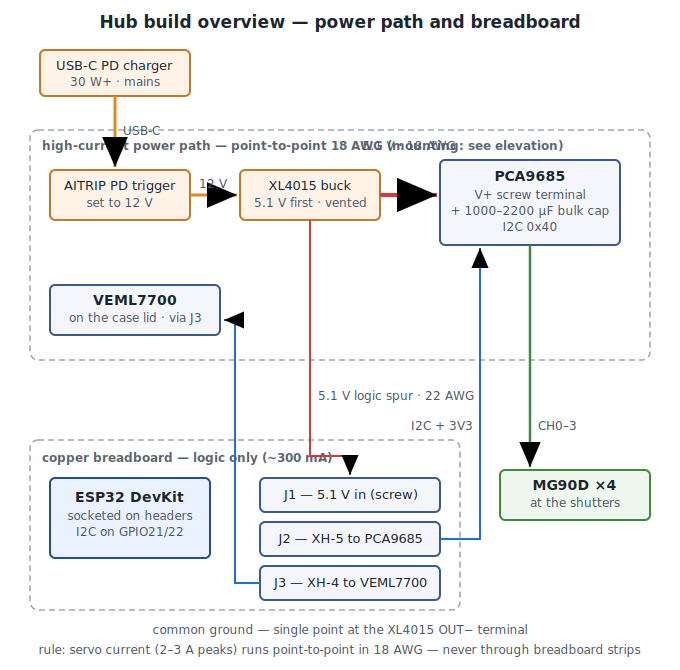
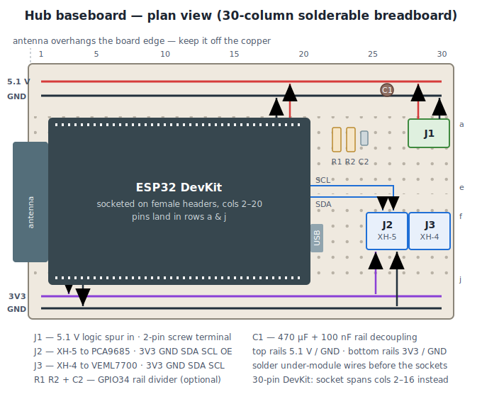
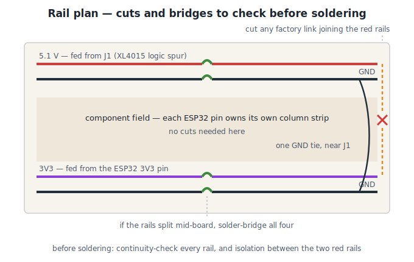
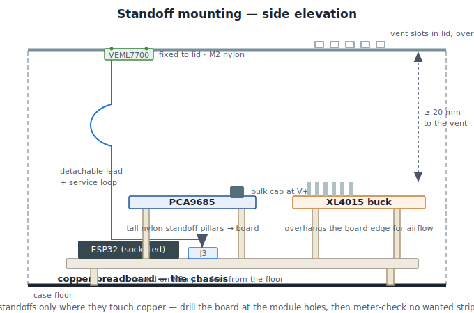
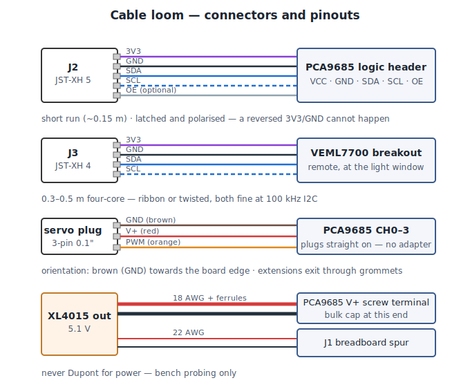

# Hardware Layout — hub prototype on solderable copper breadboard

Physical build plan for the hub: what sits on the copper breadboard, what is raised on nylon
standoffs, where the track cuts/bridges go, and which connectors to use. Companion to
[architecture.md](architecture.md) (topology) and [inventory.md](inventory.md) (BOM).

## Assumptions

- **Board:** solderable copper breadboard in the classic 400-point pattern — 30 columns of two
  5-hole strips (`a–e` / `f–j`) with a centre gap, plus a red/blue rail pair top **and** bottom
  (ElectroCookie / SB-400 style). One board builds the whole hub.
- **ESP32:** DevKit on **female pin-socket headers** (its "standoffs") so the module plugs in and
  can be swapped. Column counts below are for the 38-pin DevKitC (19 pins/side); a 30-pin DevKit
  V1 is 15 pins/side — same plan, 4 columns shorter.
- **The breadboard is the chassis.** The XL4015 and PCA9685 bolt **to the breadboard on tall nylon
  standoff pillars** (raised above the ESP32 and rails, overhanging the long edges) so the whole hub
  lifts out as one rigid assembly; the XL4015 overhang also keeps its heatsink in the airflow. The
  **VEML7700 is the exception** — it fixes to the **case lid** so it can see daylight, on a
  detachable J3 lead. The PD trigger also stands on the board, USB-C at the wall cutout.

## The one rule that shapes everything

> **Servo current (2–3 A peak) never touches the breadboard.**
> Breadboard strips are thin copper good for ~0.5–1 A. The 5.1 V *servo* path runs point-to-point
> in 18 AWG: XL4015 OUT → PCA9685 **V+ screw terminal** (bulk cap there). The breadboard carries
> only the ESP32 + logic (~300 mA), fed by its own 5.1 V spur.

---

## Diagram 1 — system overview: on-board vs raised

Common ground is single-point, at the XL4015 OUT− terminal.

---

## Diagram 2 — hub baseboard, plan view

Columns numbered 1–30 left to right. ESP32 USB port faces right (programming access); the
**antenna end overhangs the left board edge** — never sit the antenna over copper.

| Ref | Part | Position | Notes |
| --- | ---- | -------- | ----- |
| — | 2 × 19-pin female headers | cols 2–20, rows a & j | ESP32 socket. 30-pin DevKit: 15-pin headers, cols 2–16 |
| J1 | 2-pin 5.08 mm screw terminal | cols 28–30, top edge | 5.1 V logic spur in from XL4015 |
| J2 | JST-XH 5-pin | cols 25–27, row f–j side | PCA9685 logic: 3V3 · GND · SDA · SCL · OE |
| J3 | JST-XH 4-pin | cols 28–30, row f–j side | VEML7700 cable: 3V3 · GND · SDA · SCL |
| R1 R2 + C2 | 2 × 100 kΩ + 100 nF | cols 22–24 | optional GPIO34 servo-rail divider (plan D5) |
| C1 | 470 µF + 100 nF | at J1, across 5.1 V/GND rails | local decoupling (bulk cap lives at PCA9685) |

**Wiring the strips under the ESP32:** because a DevKit is wide, its pins land in rows **a** and
**j** and the module covers the rest of each strip. On a *solderable* board that's fine — the
remaining holes (b–e / f–i) of each pin column are your fan-out — but **solder every under-module
jumper and the socket headers before plugging the ESP32 in**, and route the rest on the underside.

Jumpers to fit (short solid-core on top, or bus wire underneath):

| From strip (ESP32 pin) | To |
| ---------------------- | -- |
| VIN | top **5.1 V** rail |
| GND (both) | top **GND** rail |
| 3V3 | bottom **3V3** rail |
| GPIO21 (SDA) | J2 pin 3 and J3 pin 3 |
| GPIO22 (SCL) | J2 pin 4 and J3 pin 4 |
| GPIO34 | divider mid-point (only if D5 populated) |
| bottom 3V3 / GND rails | J2 pins 1–2, J3 pins 1–2 |

---

## Diagram 3 — rail plan, cuts and bridges

The two rail pairs get **different voltages** — that's the point of having both:
**top = 5.1 V / GND** (from J1, feeds ESP32 VIN only), **bottom = 3V3 / GND** (from the ESP32
3V3 pin, feeds the I2C devices).

Check with the meter **before** soldering:

- **✂ Cut** — if your board ties top and bottom red rails together at either end (some copper
  breadboards do), cut that link: top is 5.1 V, bottom is 3V3.
- **⌒ Bridge** — if the rails are split at the mid-point (many boards copy the solderless break
  at column 15), solder-bridge all four splits — we want full-length rails.
- **No cuts** are needed in the a–e / f–j field: each ESP32 pin owns its column strip.
- Add **one GND tie** between the top and bottom GND rails, near J1.

Running the PCA9685's logic (`VCC`) and the VEML7700 from the **3V3 rail** keeps the I2C bus at
3.3 V — no level shifting, and the VEML7700 is 3.3 V-only anyway. Servo power enters the PCA9685
separately at its V+ screw terminal.

---

## Diagram 4 — raised modules: standoffs and drill plan

| Module | Holes | Standoff | Fixed to | Notes |
| ------ | ----- | -------- | -------- | ----- |
| Copper breadboard | M3 corner holes (most copper boards have them) | M3 × 10 nylon feet | case floor | the chassis; everything else hangs off it; ESP32 USB reachable |
| PCA9685 | 4 × M2.5 | M2.5 × 15+ nylon pillars | **breadboard** | raised above the rails; servo headers face the loom exit; bulk cap at V+ |
| XL4015 | 2 × M3 | M3 × 15+ nylon pillars | **breadboard** (overhanging edge) | heatsink in open air under the lid vent; ≥ 20 mm clearance |
| AITRIP PD trigger | 2 × M2.5 (varies) | M2.5 × 12 nylon | breadboard edge | USB-C aligned to the wall cutout |
| VEML7700 | 2 × M2 | M2 × 6 nylon | **case lid** | behind the light window; detachable J3 lead + service loop |

**Fixing the modules to the board.** The XL4015 and PCA9685 mounting holes aren't on 0.1" pitch, so
**drill the breadboard** at each hole — in the overhang margin where no wanted strip runs — deburr
both faces, and use **nylon screws + standoffs only** (the strips are live copper; metal hardware
would short adjacent strips). Meter-check that no strip you need was severed by a hole. Tall pillars
(~15–20 mm) let both modules sit above the ESP32 and rails and overhang the long edges; the XL4015
overhang keeps its heatsink in the airflow under the lid vent.

**Light sensor on the lid.** The VEML7700 fixes to the **case lid** (2 × M2 nylon) behind a small
window, so it reads true ambient light instead of sitting behind a board→standoff→lid tolerance
stack-up. Keep it on a **detachable J3 lead with a service loop** so the lid lifts clear of the
board-chassis. Use a **thin clear window** (or an open aperture) — not frosted or tinted; any window
costs a few % of light, so plan a firmware calibration multiplier rather than trusting raw lux
against the 60000 / 30000 solar thresholds.

---

## Diagram 5 — cable loom and connectors

### Connector recommendations (from "the different connectors I can use")

| Connection | Use | Why |
| ---------- | --- | --- |
| 12 V and 5.1 V power runs | **screw terminals** (on-module) + ferruled 18 AWG | current-rated, re-tightenable, no crimp needed |
| 5.1 V logic spur onto breadboard | **2-pin 5.08 mm screw terminal (J1)** | matches the power-chain style; won't pull out |
| I2C / logic cables (J2, J3) | **JST-XH 2.54 mm** | polarised — can't reverse 3V3/GND; latched, serviceable |
| Servos → PCA9685 | **native 0.1" servo plugs** straight onto CH0–3 | the PCA9685 header *is* a servo header; zero adapters |
| Servo loom → wall (prototype) | grommet holes + strain relief | plan D2 prototype option; revisit JST-XH panel breakout at Phase 7 |
| Anything Dupont | avoid for power; OK for bench probing only | unlatched Dupont on a servo rail is how brownouts happen |

**Don't** run 5 V or servo current through JST-XH shells rated 3 A only at a pinch, and don't use
unpolarised Dupont pairs for anything permanent — one reversed 3V3/GND on the VEML7700 kills it.

### VEML7700 light sensor — its own bus (v0.6.0, [ADR 0011](decisions/0011-dedicated-sensor-i2c-bus.md))

The sensor does **not** join the PCA9685 on GPIO21/22. It runs on a second I²C bus, `Wire1`, so a
damaged sensor lead can never wedge the servo driver. Pins are set on the web UI's **Solar** page —
default **SDA GPIO25 / SCL GPIO26**.

| Do | Why |
| -- | --- |
| **4-pin JST-XH** (3V3 / GND / SDA / SCL) at the sensor end | polarised + serviceable; the sensor sits at the enclosure light window, not next to the PCA9685 |
| Run **SDA / SCL / GND as a twisted trio** | I²C tolerates length poorly because of cable *capacitance*; twisting with ground is the cheap fix |
| Keep the lead **short — ideally < 20 cm** | a second bus buys fault isolation, **not** reach. It does not license a long run |
| **0.1 µF decoupling cap right at the sensor**, own clean 3V3 feed | don't daisy-chain its supply off the servo-side rail — servo inrush is noisy |
| Use normal GPIOs (25/26, or 32/33, 16/17) | **GPIO34–39 are input-only** and physically cannot drive an open-drain I²C line |
| Avoid strapping pins 0 / 2 / 12 / 15 and the servo pin (13) | boot-mode pins misbehave when pulled by a bus |

The VEML7700 breakout carries its own pull-ups, so on a dedicated bus there is nothing to remove
(unlike sharing, where two boards' pull-ups end up in parallel).

---

## Build order

1. Bench-set the **XL4015 to 5.1 V** with a meter, unloaded, before anything else.
2. Breadboard first pass: meter the rails, do the ✂ cut / ⌒ bridge checks from Diagram 3.
3. Solder under-ESP32 jumpers and strip fan-out wires, then the female headers, then J1/J2/J3,
   divider, and decoupling. Continuity-check every net **before** plugging the ESP32 in.
4. Mount modules on standoffs; run the 18 AWG power pairs; fit the bulk cap at PCA9685 V+
   (mind polarity).
5. Power up with **no servos**: check 5.1 V at J1 and PCA9685 V+, 3V3 rail at J2/J3, then
   `i2cdetect`-style scan expects **0x40** (PCA9685) and **0x10** (VEML7700).
6. Add one MG90D on CH0 and re-run the Phase 1 bench test; watch for resets under load.
7. **Fit each servo horn / linkage with the arm parked at HOME (slat closed).** The firmware assumes
   an un-driven channel rests at its minimum-µs "home" endpoint (see
   [decisions/0009-servo-position-memory.md](decisions/0009-servo-position-memory.md)), so assembling
   at HOME means the first move after a factory-fresh boot slews from where the arm actually is instead
   of snapping. (After that, position is remembered across reboots/OTA in NVS.)
