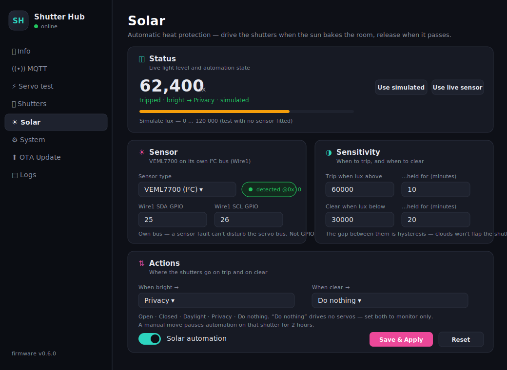
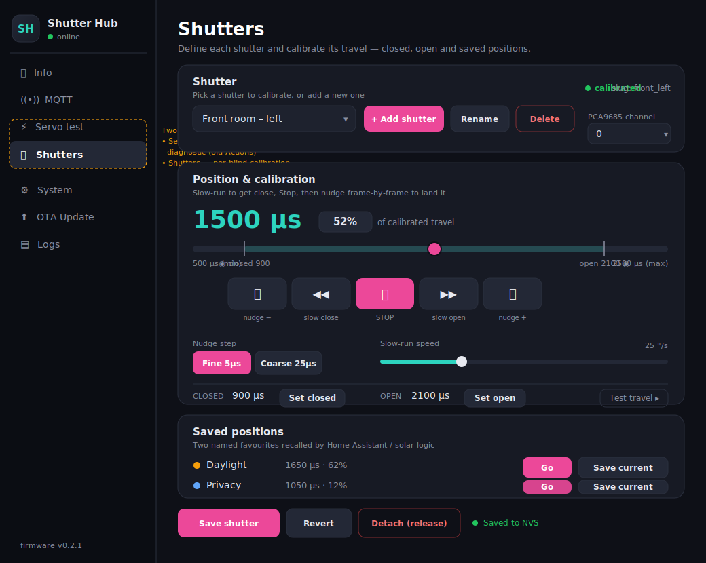

# User Guide — ESP32 Smart Shutter Hub

Day-to-day operation, once the hub is built, flashed, and calibrated. If you have not done that yet,
start at [installation.md](installation.md).

> **About the screenshots.** The web-UI pictures below are design mockups, not captures of a running
> device. They show the layout and the controls in the positions you will find them, but wording,
> colours, and version numbers on the real screens may differ — and will drift as the firmware moves
> on. Trust the device in front of you over the picture.

The hub has **four faces**, and they all drive the same servos and stay in sync with each other:

| Face | Address | Best for |
| ---- | ------- | -------- |
| **Web UI** | `http://shutter-hub.local` | Setup, calibration, diagnostics, OTA |
| **Home Assistant** | The MQTT device, or the Lovelace card | Automations, dashboards, voice |
| **Apple Home** | Window Covering accessories | Siri, iPhone, remote access |
| **Lovelace card** | A dashboard tile | Everyday tapping — the nicest of the four |

Move a shutter anywhere and every other face updates within a quarter-second. Retained MQTT state
means Home Assistant knows the right position even after a restart.

---

## The four positions

Every shutter carries four saved positions, set during calibration and stored in NVS:

| Position | Meaning | HA position |
| -------- | ------- | ----------- |
| **Full open** | Slats horizontal, maximum light | 100 % |
| **Daylight** | Comfortable daytime angle — light in, glare out | wherever you saved it |
| **Privacy** | Slats angled closed, light but no sightline | wherever you saved it |
| **Full close** | Slats fully shut | 0 % |

Open and Close are the endpoints of travel; Daylight and Privacy are named favourites anywhere in
between. Any position from 0–100 % is reachable with the slider — the four are just the ones worth
naming.

To change a favourite, jog the shutter to where you want it and press **Save current** on that row
in the web UI's **Shutters → Positions** card, or press the `button.*_save_daylight` /
`button.*_save_privacy` entity in Home Assistant.

---

## Using the Lovelace card

The card shows every configured shutter as a tile — a slat glyph whose angle tracks the real
position, plus its name and state.

**Group mode** is the default: the button bar and the position slider act on **all** shutters at
once. Tap **Open**, **Close**, **Daylight**, or **Privacy** and the whole bank moves together —
literally together, since each shutter drives its own PCA9685 channel concurrently rather than one
after another.

**Individual mode**: tap a tile and the buttons and slider scope to that shutter alone. Tap it again,
or press **Select all**, to go back to the group.

**Manual position**: the slider commands any angle from 0–100 %, for the times none of the four
presets is what you want.

**Stop** halts a move in flight.

---

## Using Home Assistant directly

Each shutter is a native `cover` entity, so everything Home Assistant knows how to do with covers
works: `cover.open_cover`, `cover.close_cover`, `cover.stop_cover`, `cover.set_cover_position`,
scenes, scripts, voice assistants, the standard more-info dialog.

A worked example — close the shutters to Privacy at sunset:

```yaml
alias: Shutters to privacy at sunset
triggers:
  - trigger: sun
    event: sunset
    offset: "-00:15:00"
actions:
  - action: button.press
    target:
      entity_id:
        - button.shutter_hub_front_room_left_privacy
        - button.shutter_hub_front_room_right_privacy
```

Pressing the preset buttons is preferable to `set_cover_position` with a hard-coded number: the
preset follows your calibration, so if you re-save Privacy the automation follows it without edits.

The hub also exposes, once per device rather than per shutter:

| Entity | Use |
| ------ | --- |
| `sensor.*_light_level` | Lux — chart it, or trigger your own automations on it |
| `sensor.*_solar_state` | `idle` / `armed` / `tripped` |
| `switch.*_solar_automation` | Turn heat protection on and off from a dashboard |
| `number.*_trip_lux`, `number.*_clear_lux` | Adjust the thresholds without opening the web UI |

Those two `number` entities are the reason threshold tuning is comfortable: put them on a dashboard
beside a lux history graph and adjust while watching the room.

---

## Using Apple Home

> **Not currently usable — pairing does not work.** The HomeSpan bridge builds, boots and
> advertises, but no controller has ever completed *Add Accessory* on the author's hardware, and the
> work is parked. Nothing else is affected: leave HomeKit disabled and the web UI, Home Assistant,
> the Lovelace card and solar automation all work normally. See
> [installation.md](installation.md#step-8--pair-with-apple-home-optional).

Once pairing works, each shutter is a **Window Covering** accessory. You'd ask Siri to "open the
front room shutters", or drag the slider in the Home app. Because the hub bridges through HomeSpan,
the accessories appear individually and can go in different rooms if that suits your layout.

Apple Home has no concept of your Daylight and Privacy presets — model them as Home app *scenes* that
set specific percentages, or trigger the Home Assistant buttons instead.

---

## Solar heat protection

> Works on any board. By default the sensor gets its **own I²C bus** so a fault on its lead can't
> disturb the servos. Chips with a single I²C controller (the ESP32-C3) instead **share** the
> PCA9685's bus — the Solar page picks this for you and explains why. See
> [ADR 0012](decisions/0012-selectable-sensor-i2c-bus.md).

The VEML7700 watches the light level. When lux stays **above** the trip threshold for the trip dwell,
the hub moves the shutters to your chosen bright-action position. When lux stays **below** the clear
threshold for the clear dwell, it moves them to the clear-action position.



The state machine reads:

| State | Meaning |
| ----- | ------- |
| **idle** | Light is below the trip threshold; nothing pending |
| **armed** | Light is above the trip threshold, dwell timer counting |
| **tripped** | The bright action has fired; watching for the clear condition |

Two things are worth internalising.

**Hysteresis is the point.** Trip and clear are deliberately different numbers, and both have dwell
timers. Without that gap, a cloud crossing the sun would drive your shutters back and forth all
afternoon. If yours are twitchy, widen the gap or lengthen the dwells before you touch anything else.

**Manual override wins for 2 hours.** Move a shutter yourself — web UI, Home Assistant, Apple Home,
does not matter — and solar automation stops touching *that* shutter for two hours. The others carry
on. Then it resumes. Nothing to press, nothing to remember to undo.

**Do nothing** is a first-class action for both trip and clear. A "do nothing" clear leaves the slats
where the trip put them, which is often what you want on a west-facing window in summer. Setting both
to **Do nothing** turns the hub into a light monitor that reports to Home Assistant and moves nothing.

To tune the thresholds, watch `sensor.*_light_level` in Home Assistant across a few sunny days and
note the lux when direct sun actually hits the room. Set trip a little below that, and clear well
under it. The **Simulate lux** slider on the Solar page lets you rehearse the whole sequence at any
time — press **Use simulated**, drag it past the trip point, wait out the dwell, and watch the state
advance. **Use live sensor** returns to reality.

---

## Recalibrating

Shutters drift. Linkages settle, servo horns creep, someone leans on a blind. Recalibration takes a
minute per shutter and does not disturb anything else.

Open **Shutters**, pick the blind, use **slow close** / **stop** / **nudge** to land the endpoint
exactly where you want it, and press **Save current** on the row concerned. It writes to NVS
immediately — no save button, no reboot.



The transport controls, in the order you actually use them:

| Control | What it does |
| ------- | ------------ |
| `◀◀` **slow close** / `▶▶` **slow open** | Run continuously at the speed slider's rate (5–120 °/s) |
| `⏸` **stop** | Halt where it is |
| `⏮` / `⏭` **nudge** | One step: 5 µs (Fine) or 25 µs (Coarse) |
| **Detach (release)** | Cut the PWM so the servo goes limp — for moving a blind by hand |

Watch the microsecond readout, not the percentage: percentage is derived from the endpoints you are
in the middle of changing.

**If a servo hums and gets hot at an endpoint**, it is stalling against the linkage. Back that
endpoint off by 25 µs and re-save. A stalled MG90D will cook itself.

---

## Reading the Logs page

**Logs** is a live WebSocket stream of everything the firmware logs — WiFi events, MQTT connect and
every message in and out, servo commands, solar state transitions, OTA progress. It is the first
place to look when something behaves oddly, and it is almost always conclusive: MQTT auth failures,
I²C sensor detection, and dropped WiFi all announce themselves plainly.

The stream is live only — nothing is persisted across a reboot.

---

## Routine maintenance

**Updating.** New releases install over WiFi from the **OTA Update** page. Upload the filesystem
image first if the release notes mention web-UI changes, then the firmware, which reboots the board.
Settings, calibration, and pairings survive. Full procedure in
[installation.md](installation.md#updating-later-ota).

**After a power cut**, the hub remembers where every servo was and slews to its first commanded
position rather than snapping to it. Nothing to do.

**Moving house, or changing router.** **System → WiFi** scans and reconnects in place. If the hub
cannot reach the old network at all, **System → Quick Actions → Reset WiFi** reboots it into the
`Shutter-Hub-Setup` captive portal, exactly as on first boot. Everything else is preserved.

**Reset config** wipes MQTT, security, HomeKit, and solar settings back to defaults. It does not
spare your shutter definitions — treat it as a last resort, and expect to recalibrate.

---

## When something is wrong

Start on the **Info** page. Beneath the device and network cards, **Hardware & wiring** lists every
device the firmware expects — the PCA9685 with its I²C bus, pins and address, a row per shutter with
its channel and whether it is calibrated, and the light sensor with its bus, pins, and whether it is
answering at `0x10`. It is the fastest way to tell a wiring fault from a configuration one. The same
card reports **HomeKit** as disabled, enabled-pending-reboot, active, or paired.

Everything in that table is set elsewhere — servo bus pins on **Servo test**, channels on
**Shutters**, the sensor bus on **Solar**. It shows what the hub believes; it does not change it.

| Symptom | First thing to check |
| ------- | -------------------- |
| One shutter unresponsive, others fine | Its PCA9685 channel assignment on the **Shutters** page; then the servo lead |
| All shutters unresponsive, web UI fine | The 5.1 V servo rail — the ESP32 runs happily on USB power alone while the servos have none |
| Shutter goes the wrong way | **Invert position scale** on that shutter's detail card |
| Position in HA disagrees with reality | Endpoints drifted — recalibrate |
| Solar never fires | **Solar automation** switch, then whether a manual move started a 2-hour override |
| Solar fires constantly | Trip and clear too close together; widen the gap and lengthen the dwells |
| Everything is unavailable in HA | The hub is offline — its MQTT last-will fired. Check power and WiFi |
| Web UI unreachable, hub apparently up | mDNS. Try the IP address from your router's DHCP table |

For anything not on that list, open the **Logs** page and reproduce the problem while watching.
